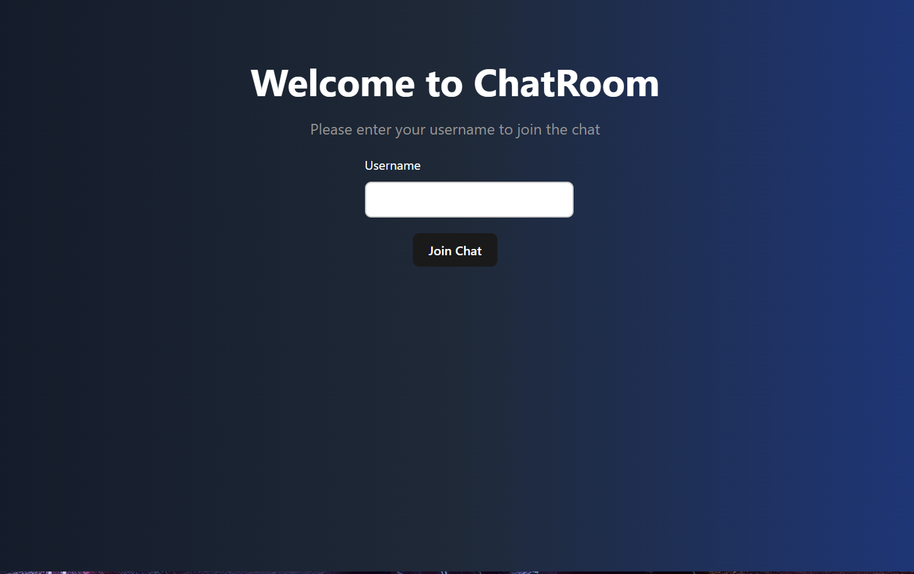
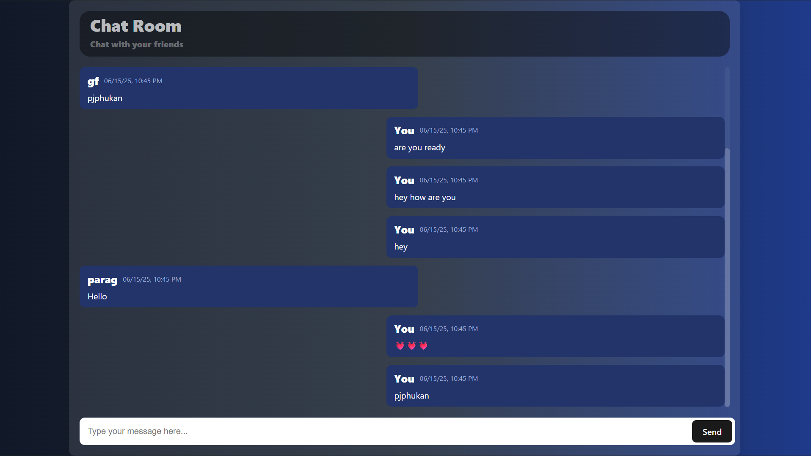

# [🧩 Real-Time Chat Application – MERN Stack (No Socket.IO)](https://chat-application-pjphukan.netlify.app)

A full-stack real-time chat application built using the **MERN stack** (MongoDB, Express.js, React.js, Node.js), featuring WebSocket-based communication using the native `ws` module instead of Socket.IO.

This application allows users to join a shared chatroom, send/receive messages in real-time, and view recent chat history on login.

---

## 🚀 Features

- 🌐 **Real-time messaging** with native WebSocket (`ws` module)
- 🧑‍🤝‍🧑 **Multiple users** in a single shared chatroom
- 💬 **Live message broadcast** to all connected users
- 🗂️ **Recent 50 messages** loaded on join
- 💾 **MongoDB** storage of all messages (username, message, timestamp)
- 📦 Organized **MERN stack** project structure
- ⚙️ No external libraries like Socket.IO

---

## 🛠️ Tech Stack

- **Frontend**: React.js 
- **Backend**: Node.js + Express.js
- **WebSocket**: Native WebSocket using `ws` module
- **Database**: MongoDB (via Mongoose)

---

## 📁 Project Structure

```
chat-app/
├── backend/               # Express server + WebSocket + MongoDB
│   ├── models/            # Mongoose Message model
│   ├── config/            # MongoDB connection setup
│   ├── wsServer.js        # WebSocket server logic
│   └── index.js           # Express + WebSocket initialization
├── frontend/              # React app with WebSocket client
│   ├── components/        # UI components (Message, Username prompt, etc.)
│   ├── src/
│   │   ├── App.jsx        # Main app
│   │   └── main.jsx       # Vite entry
├── README.md              # Project documentation
```

---

## 🧑‍💻 Setup Instructions

### 1️⃣ Clone the repository

```bash
git https://github.com/PJPhukan/Real-Time_MERN-Stack_chat_application-
cd Real-Time_MERN-Stack_chat_application-
```

---

### 2️⃣ Backend Setup

```bash
cd backend
npm install
```

Create a `.env` file inside `/backend`:

```env
PORT=8080
MONGO_URI=your database url 
```

Start the backend server:

```bash
node index.js
```

---

### 3️⃣ Frontend Setup

```bash
cd frontend
npm install
```

Create a `.env` file inside `/frontend`:

```env
VITE_SOCKET_URL=ws://localhost:8000
```

Start the development server:

```bash
npm run dev
```

---

## 🌐 Deployment Links

- 🔗 **Frontend (Vercel/Netlify)**: https://chat-application-pjphukan.netlify.app
- 🔗 **Backend (Render)**: https://real-time-mern-stack-chat-application-rke3.onrender.com

---

## 📸 UI Preview





---


## 🤝 Contributing

Pull requests and feature suggestions are welcome. Fork the repo, make your changes, and open a pull request.

---

